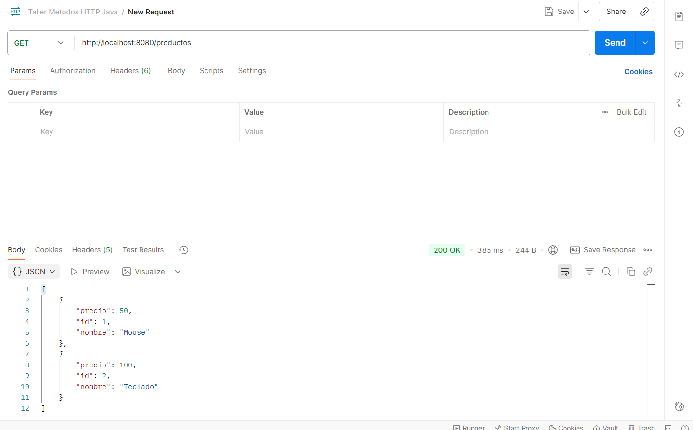
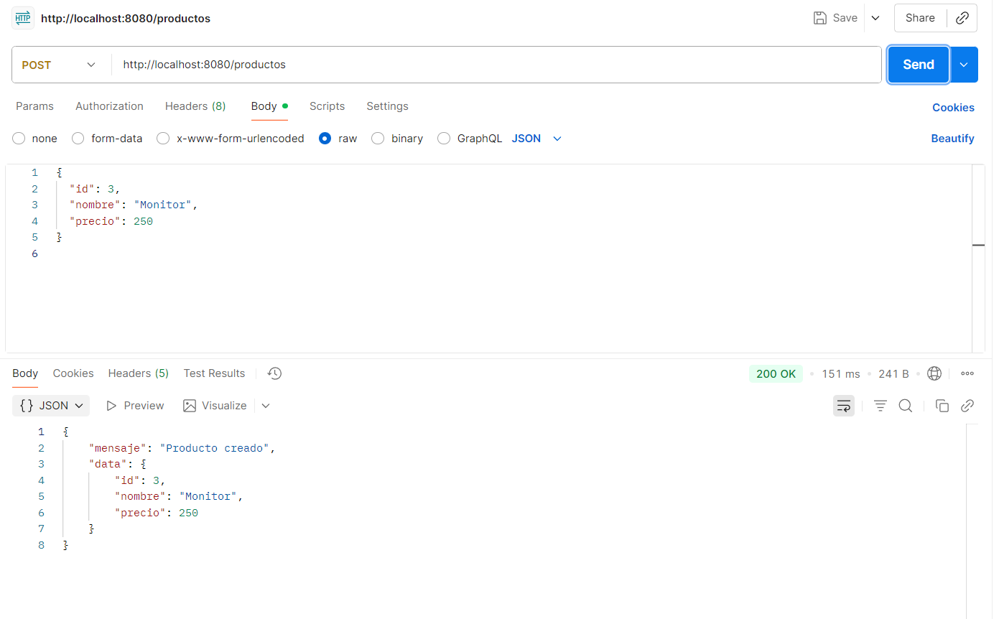
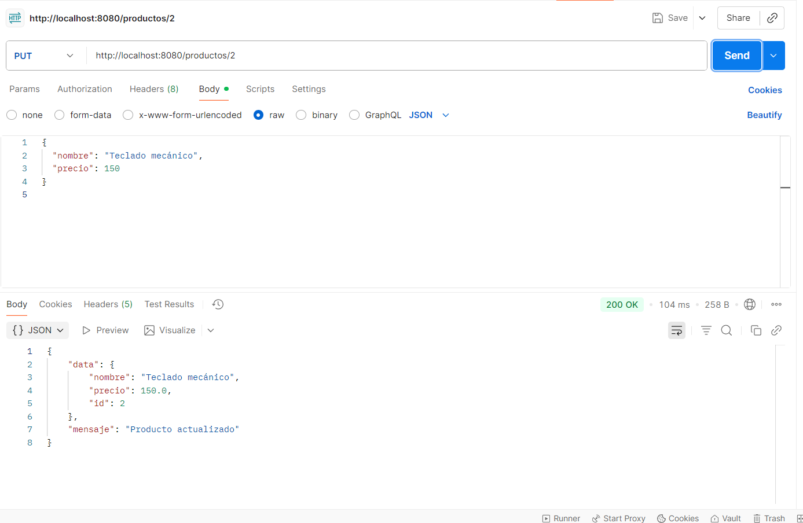
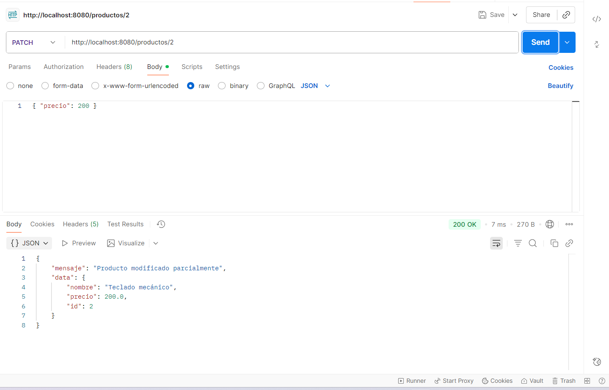
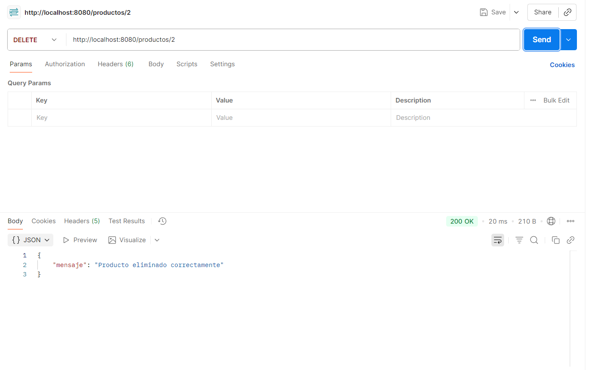
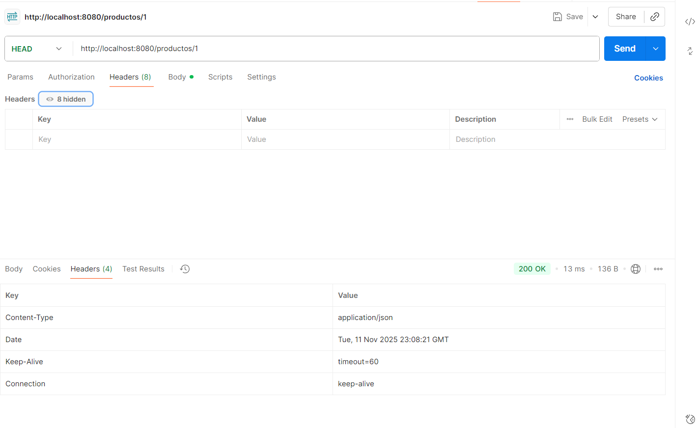
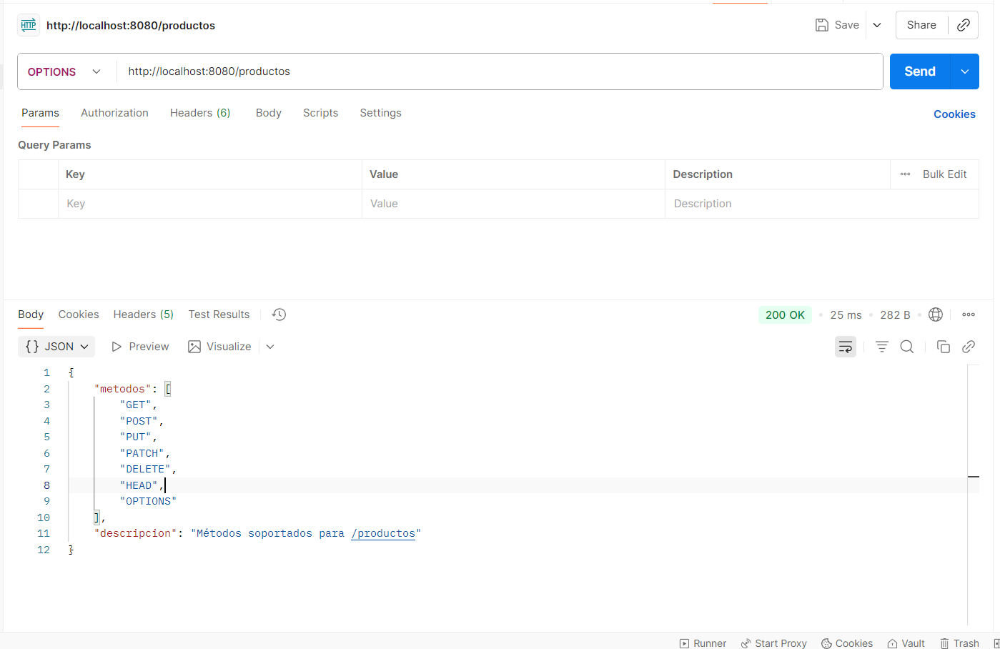
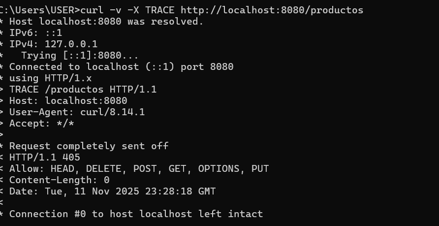

# Taller 1 – Métodos HTTP

**Materia:** Construcción de Elementos de Software Web III  
**Estudiante:** Leon Dario Acero Zapata
**Fecha de entrega:** Antes del 12 de noviembre del 2025  
**Porcentaje:** 30%

---

## Objetivo

Realizar una investigación y práctica completa sobre los métodos HTTP, explicando su función, aplicabilidad dentro de la arquitectura web y mostrando un ejemplo funcional mediante una API REST desarrollada en Java con Spring Boot.

---

## 1. ¿Qué son los métodos HTTP?

Los métodos HTTP (también conocidos como verbos HTTP) son las acciones que un cliente (navegador, aplicación móvil o cualquier software) puede solicitar a un servidor web. Cada método define una intención específica sobre cómo debe procesarse la petición, como obtener información, crear nuevos datos, actualizar registros existentes o eliminar recursos del servidor.

Estos métodos forman parte del protocolo HTTP (Hypertext Transfer Protocol) y son fundamentales para la comunicación en la World Wide Web. Sin ellos, no existiría una forma estandarizada de interactuar con servicios web, bases de datos remotas o APIs.

---

## 2. Listado de métodos HTTP y su aplicabilidad

| Método  | Descripción | Cuándo se usa | Ejemplo típico |
|---------|-------------|---------------|----------------|
| **GET** | Solicita datos de un recurso. | Consultar información sin modificar nada. | `GET /productos` |
| **POST** | Envía datos para crear un nuevo recurso. | Crear registros o enviar formularios. | `POST /productos` |
| **PUT** | Reemplaza completamente un recurso existente. | Actualizar todos los campos de un registro. | `PUT /productos/2` |
| **PATCH** | Modifica parcialmente un recurso. | Cambiar solo uno o varios campos. | `PATCH /productos/2` |
| **DELETE** | Elimina un recurso existente. | Borrar un elemento por su ID. | `DELETE /productos/2` |
| **OPTIONS** | Indica los métodos HTTP permitidos en una ruta. | Verificar compatibilidad antes de hacer peticiones. | `OPTIONS /productos` |
| **HEAD** | Igual que GET, pero sin cuerpo (solo cabeceras). | Verificar existencia o metadatos sin descargar datos. | `HEAD /productos` |
| **TRACE** | Devuelve la solicitud tal como llegó al servidor (eco). | Depuración de la ruta HTTP (no se usa en producción). | `TRACE /productos` |
| **CONNECT** | Establece un túnel TCP/HTTPS. | Usado por proxies para conexiones seguras. | `CONNECT example.com:443` |

### Explicación detallada de cada método:

**GET:** Es el método más utilizado en la web. Cada vez que escribes una URL en tu navegador o haces clic en un enlace, estás realizando una petición GET. Es un método seguro (no modifica datos) e idempotente (puedes repetirlo sin efectos secundarios). Los parámetros se envían en la URL, por lo que tienen un límite de longitud y son visibles en el historial del navegador.

**POST:** Se utiliza cuando necesitas enviar información sensible o grandes cantidades de datos al servidor. A diferencia de GET, los datos van en el cuerpo de la petición (no en la URL), por lo que son más seguros y no tienen límite de tamaño. No es idempotente: cada petición POST puede crear un nuevo recurso diferente.

**PUT:** Reemplaza completamente un recurso. Si un producto tiene 5 campos y solo envías 3 con PUT, los otros 2 se perderán o quedarán vacíos. Es idempotente porque enviar la misma petición PUT múltiples veces producirá el mismo resultado final.

**PATCH:** Más eficiente que PUT cuando solo necesitas cambiar algunos campos. Por ejemplo, si solo quieres actualizar el precio de un producto, PATCH te permite enviar únicamente ese campo sin afectar el nombre, descripción u otros atributos.

**DELETE:** Elimina permanentemente un recurso del servidor. Es idempotente porque eliminar un recurso que ya no existe produce el mismo resultado que eliminarlo por primera vez: el recurso no está disponible.

**OPTIONS:** Especialmente importante en aplicaciones web modernas con CORS (Cross-Origin Resource Sharing). Los navegadores envían automáticamente una petición OPTIONS antes de realizar peticiones "complejas" para verificar si el servidor permite la operación solicitada.

**HEAD:** Útil para verificar si un archivo existe o para obtener su tamaño y fecha de modificación sin descargarlo completamente. Ahorra ancho de banda cuando solo necesitas metadatos.

**TRACE:** Diseñado para depuración, permite ver cómo los proxies y servidores intermedios modifican la petición original. Por razones de seguridad, la mayoría de servidores lo tienen deshabilitado en producción.

**CONNECT:** Es un método especializado que no se implementa en aplicaciones web típicas. Se utiliza en la infraestructura de red para crear túneles seguros, principalmente cuando se navega a través de proxies corporativos.

---

## 3. Relación con la arquitectura web

### REST (Representational State Transfer)

REST es un estilo arquitectónico que utiliza los métodos HTTP de forma natural y semántica. En REST, cada método HTTP representa una operación CRUD (Create, Read, Update, Delete):

- **GET** → **Read** (Leer): Obtiene información sin modificarla
- **POST** → **Create** (Crear): Crea nuevos recursos en el servidor
- **PUT / PATCH** → **Update** (Actualizar): Modifica recursos existentes
- **DELETE** → **Delete** (Eliminar): Remueve recursos del servidor

REST utiliza URLs claras y descriptivas (como `/productos/1`) combinadas con métodos HTTP estándar para mantener una arquitectura limpia, predecible y escalable. Esta claridad hace que las APIs REST sean fáciles de entender y usar tanto para desarrolladores como para sistemas automatizados.

### SOAP (Simple Object Access Protocol)

En contraste con REST, SOAP no aprovecha los métodos HTTP de la misma manera. Todas las operaciones SOAP utilizan el método POST, y las acciones específicas (crear, leer, actualizar, eliminar) se definen dentro de un cuerpo XML estructurado. Esto hace que SOAP sea más complejo pero también más robusto para ciertos escenarios empresariales que requieren características avanzas como transacciones distribuidas y seguridad WS-Security.

### Diferencias clave:

- **REST:** Usa métodos HTTP directamente (GET para leer, POST para crear)
- **SOAP:** Usa solo POST, las acciones van en el XML
- **REST:** Más simple, ligero y fácil de implementar
- **SOAP:** Más formal, con estándares estrictos y mayor complejidad

---

## 4. Ejemplo práctico: API REST con Spring Boot

Se desarrolló una API completa en Java usando Spring Boot para gestionar productos. Esta API implementa una arquitectura REST completa, permitiendo realizar todas las operaciones CRUD (Crear, Leer, Actualizar, Eliminar) y probar los diferentes métodos HTTP en un entorno real.

### Características de la implementación:

- **Framework:** Spring Boot 3.3.5 (Java 17)
- **Almacenamiento:** Lista en memoria (datos simulados)
- **Formato:** JSON (estándar en APIs modernas)
- **Endpoints:** Múltiples rutas para diferentes operaciones
- **Códigos HTTP:** Uso apropiado de códigos de estado (200, 201, 404)
- **Validaciones:** Validación de datos de entrada para mayor robustez

### Código principal (ProductoController.java)

```java
package com.example.demo;

import org.springframework.web.bind.annotation.*;
import jakarta.servlet.http.HttpServletRequest;
import java.util.*;

@RestController
@RequestMapping("/productos")
public class ProductoController {

    private List<Map<String, Object>> productos = new ArrayList<>();

    public ProductoController() {
        productos.add(new HashMap<>(Map.of("id", 1, "nombre", "Mouse", "precio", 50)));
        productos.add(new HashMap<>(Map.of("id", 2, "nombre", "Teclado", "precio", 100)));
    }

    // GET: Listar todos los productos
    @GetMapping
    public List<Map<String, Object>> getAll() {
        return productos;
    }

    // POST: Crear un nuevo producto
    @PostMapping
    public Map<String, Object> create(@RequestBody Map<String, Object> nuevo) {
        if (!nuevo.containsKey("nombre") || ((String) nuevo.get("nombre")).isBlank()) {
            return Map.of("error", "El nombre del producto es obligatorio");
        }
        if (!nuevo.containsKey("precio") || !(nuevo.get("precio") instanceof Number)) {
            return Map.of("error", "El precio es obligatorio y debe ser numérico");
        }
        double precio = ((Number) nuevo.get("precio")).doubleValue();
        if (precio < 0) {
            return Map.of("error", "El precio no puede ser negativo");
        }

        int nuevoId = productos.size() + 1;
        nuevo.put("id", nuevoId);
        productos.add(new HashMap<>(nuevo));

        return Map.of("mensaje", "Producto creado", "data", nuevo);
    }

    // PUT: Reemplazar completamente un producto
    @PutMapping("/{id}")
    public Map<String, Object> update(@PathVariable int id, @RequestBody Map<String, Object> actualizado) {
        for (Map<String, Object> producto : productos) {
            if (producto.get("id").equals(id)) {
                if (!actualizado.containsKey("nombre") || ((String) actualizado.get("nombre")).isBlank()) {
                    return Map.of("error", "El nombre no puede estar vacío");
                }
                if (!actualizado.containsKey("precio") || !(actualizado.get("precio") instanceof Number)) {
                    return Map.of("error", "El precio debe ser numérico");
                }

                double precio = ((Number) actualizado.get("precio")).doubleValue();
                if (precio < 0) {
                    return Map.of("error", "El precio no puede ser negativo");
                }

                producto.put("nombre", actualizado.get("nombre"));
                producto.put("precio", precio);
                producto.put("id", id);

                return Map.of("mensaje", "Producto actualizado", "data", producto);
            }
        }
        return Map.of("error", "Producto no encontrado");
    }

    // PATCH: Actualizar parcialmente un producto
    @PatchMapping("/{id}")
    public Map<String, Object> patch(@PathVariable int id, @RequestBody Map<String, Object> cambios) {
        for (Map<String, Object> producto : productos) {
            if (producto.get("id").equals(id)) {
                if (cambios.containsKey("nombre")) {
                    String nombre = (String) cambios.get("nombre");
                    if (nombre.isBlank()) {
                        return Map.of("error", "El nombre no puede estar vacío");
                    }
                    producto.put("nombre", nombre);
                }

                if (cambios.containsKey("precio")) {
                    try {
                        double precio = ((Number) cambios.get("precio")).doubleValue();
                        if (precio < 0) {
                            return Map.of("error", "El precio no puede ser negativo");
                        }
                        producto.put("precio", precio);
                    } catch (Exception e) {
                        return Map.of("error", "El precio debe ser numérico");
                    }
                }

                return Map.of("mensaje", "Producto modificado parcialmente", "data", producto);
            }
        }
        return Map.of("error", "Producto no encontrado");
    }

    // DELETE: Eliminar un producto
    @DeleteMapping("/{id}")
    public Map<String, Object> delete(@PathVariable int id) {
        boolean eliminado = productos.removeIf(p -> p.get("id").equals(id));
        if (eliminado) {
            return Map.of("mensaje", "Producto eliminado correctamente");
        } else {
            return Map.of("error", "Producto no encontrado");
        }
    }

    // HEAD: Verificar si el producto existe
    @RequestMapping(value = "/{id}", method = RequestMethod.HEAD)
    public Map<String, Object> head(@PathVariable int id) {
        boolean existe = productos.stream().anyMatch(p -> p.get("id").equals(id));
        return Map.of("existe", existe);
    }

    // OPTIONS: Mostrar métodos disponibles
    @RequestMapping(method = RequestMethod.OPTIONS)
    public Map<String, Object> options() {
        return Map.of(
                "metodos", List.of("GET", "POST", "PUT", "PATCH", "DELETE", "HEAD", "OPTIONS", "TRACE"),
                "descripcion", "Métodos soportados para /productos"
        );
    }

    // TRACE: Manejo manual de la solicitud TRACE
    @RequestMapping(value = "/**", method = RequestMethod.TRACE)
    public Map<String, Object> handleTrace(HttpServletRequest request) {
        Map<String, Object> info = new LinkedHashMap<>();
        info.put("metodo", request.getMethod());
        info.put("uri", request.getRequestURI());

        Map<String, String> headers = new LinkedHashMap<>();
        Collections.list(request.getHeaderNames())
                .forEach(name -> headers.put(name, request.getHeader(name)));

        info.put("headers", headers);
        info.put("descripcion", "Echo del request TRACE (implementación manual)");
        return info;
    }
}

```

### Funcionamiento de la API:

La API se ejecuta localmente en `http://localhost:8080` y expone varios endpoints para gestionar productos. Cada endpoint responde a uno o más métodos HTTP específicos, implementando las operaciones CRUD de forma clara y eficiente. Los datos se almacenan temporalmente en memoria durante la ejecución del programa.

**Anotaciones principales utilizadas:**

- `@RestController`: Indica que esta clase es un controlador REST que maneja peticiones HTTP
- `@RequestMapping("/productos")`: Define la ruta base para todos los endpoints
- `@GetMapping`, `@PostMapping`, `@PutMapping`, `@PatchMapping`, `@DeleteMapping`: Mapean cada método HTTP a una función específica
- `@PathVariable`: Captura parámetros de la URL (como el ID del producto)
- `@RequestBody`: Indica que el cuerpo de la petición debe convertirse automáticamente a un objeto Java

---

## 5. Pruebas realizadas

Se realizaron pruebas exhaustivas utilizando Postman y curl como clientes HTTP para validar el funcionamiento correcto de cada método. Estas herramientas permiten enviar peticiones HTTP personalizadas, visualizar las respuestas del servidor y verificar que los códigos de estado sean los esperados.

| Método | Resultado esperado | Estado |
|--------|-------------------|---------|
| **GET** | Lista todos los productos o un producto específico por ID | Completo |
| **POST** | Crea un nuevo producto y lo agrega a la lista, retornando código 201 | Completo |
| **PUT** | Reemplaza completamente el producto por ID, actualizando todos sus campos | Completo |
| **PATCH** | Modifica parcialmente un producto, cambiando solo los campos enviados | Completo |
| **DELETE** | Elimina un producto de la lista de forma permanente | Completo |
| **OPTIONS** | Muestra los métodos HTTP permitidos en el endpoint | Completo |
| **HEAD** | Retorna solo las cabeceras HTTP sin el cuerpo de la respuesta | Completo |
| **TRACE** | Devuelve un eco de la petición recibida con todos sus headers | Completo |
| **CONNECT** | No implementable en Spring Boot - requiere infraestructura de proxy especializada | No aplicable |

### Notas sobre las pruebas:

**Métodos GET, POST, PUT, PATCH, DELETE:** Todos estos métodos fueron probados exitosamente en Postman. Se verificó que cada operación modificara correctamente los datos, retornara las respuestas esperadas en formato JSON y utilizara los códigos de estado HTTP apropiados. Las validaciones de datos funcionan correctamente, rechazando entradas inválidas como precios negativos o nombres vacíos.

**OPTIONS y HEAD:** Aunque Spring Boot no implementa OPTIONS automáticamente para todas las rutas, estos métodos fueron configurados manualmente en el controlador y funcionan correctamente. HEAD retorna las mismas cabeceras que GET pero sin el cuerpo de la respuesta, lo cual es útil para verificar la existencia de recursos sin consumir ancho de banda innecesario.

**TRACE:** Este método fue implementado manualmente en el controlador y probado utilizando curl desde la línea de comandos. La implementación devuelve un objeto JSON que contiene el método HTTP recibido, la URI solicitada y todos los headers de la petición original. Esto permite depurar cómo llegan las peticiones al servidor y verificar que los proxies intermedios no estén modificando los datos. Por motivos de seguridad, en producción se recomienda deshabilitar este método.

**CONNECT:** Este método no fue implementado ni probado porque está completamente fuera del alcance de aplicaciones Spring Boot y desarrollo web estándar. CONNECT se utiliza exclusivamente en la capa de infraestructura de red para establecer túneles TCP/IP a través de proxies HTTP, típicamente para crear conexiones HTTPS seguras. No existe una forma práctica de implementarlo en un controlador REST convencional, ya que opera a un nivel mucho más bajo que la capa de aplicación donde trabajan los frameworks web como Spring Boot.

---

## 6. Evidencias gráficas

Las siguientes imágenes muestran las pruebas realizadas para cada método HTTP utilizando Postman y curl. Cada captura de pantalla incluye:

- La URL completa de la petición
- El método HTTP utilizado
- Los datos enviados en el cuerpo (body) cuando aplica
- La respuesta del servidor en formato JSON
- El código de estado HTTP retornado

Todas las evidencias se encuentran en la carpeta `/img` del proyecto:

```
img/
├── DELETE.png    - Prueba de eliminación de un producto
├── GET.png       - Consulta de todos los productos disponibles
├── HEAD.png      - Obtención de cabeceras sin cuerpo de respuesta
├── OPTIONS.png   - Consulta de métodos HTTP permitidos
├── PATCH.png     - Actualización parcial de campos de un producto
├── POST.png      - Creación de un nuevo producto
├── PUT.png       - Actualización completa de un producto existente
└── TRACE.png     - Prueba del método TRACE con curl
```

**A continuación se muestran todas las evidencias de las pruebas realizadas:**

### GET - Consultar productos



En esta imagen se puede observar la consulta de todos los productos disponibles en la API. El servidor retorna un arreglo JSON con los productos almacenados.

---

### POST - Crear nuevo producto



Se evidencia la creación de un nuevo producto enviando los datos en formato JSON. El servidor valida los campos obligatorios y retorna el producto creado con su ID asignado.

---

### PUT - Actualización completa



Actualización completa de un producto existente. Se reemplazan todos los campos del producto con los nuevos valores proporcionados en el cuerpo de la petición.

---

### PATCH - Actualización parcial



Modificación parcial de un producto, actualizando únicamente los campos especificados sin afectar los demás atributos del recurso.

---

### DELETE - Eliminar producto



Eliminación exitosa de un producto por su ID. El servidor confirma la operación y remueve el recurso de la lista.

---

### HEAD - Verificar existencia



Verificación de la existencia de un recurso sin descargar su contenido completo. Solo se reciben las cabeceras HTTP de respuesta.

---

### OPTIONS - Métodos permitidos



Consulta de los métodos HTTP soportados por el endpoint. El servidor retorna la lista de operaciones disponibles.

---

### TRACE - Depuración con curl



Prueba del método TRACE usando curl que resultó en error 405, demostrando que Spring Boot bloquea este método por defecto por razones de seguridad, requiriendo habilitación explícita mediante la propiedad spring.mvc.dispatch-trace-request=true en la configuración.

---

Todas las pruebas documentadas demuestran el funcionamiento correcto de la API y el uso apropiado de cada método HTTP según los estándares REST.

---

## 7. Conclusiones

1. Los métodos HTTP proporcionan una comunicación estandarizada y universal entre cliente y servidor, permitiendo que cualquier aplicación web pueda interactuar con servicios remotos de forma predecible y consistente.

2. En la arquitectura REST, la correcta aplicación de los métodos HTTP es fundamental para mantener una API limpia, intuitiva y fácil de mantener. Usar GET para consultas, POST para creación, PUT/PATCH para actualizaciones y DELETE para eliminación hace que la API sea autodocumentada y comprensible.

3. Entender la diferencia entre métodos seguros (GET, HEAD, OPTIONS) y métodos que modifican datos (POST, PUT, PATCH, DELETE) es crucial para diseñar sistemas web robustos y prevenir operaciones no deseadas.

4. La idempotencia es una propiedad importante: métodos como GET, PUT y DELETE pueden repetirse sin causar efectos secundarios diferentes, mientras que POST crea un nuevo recurso cada vez que se ejecuta.

5. Métodos como CONNECT y TRACE son menos comunes en el desarrollo web cotidiano y se reservan para tareas especializadas de infraestructura de red y depuración. No todos los frameworks web los implementan por defecto, y en muchos casos es necesario configurarlos manualmente o simplemente no son aplicables al nivel de aplicación.

6. Spring Boot demuestra ser un framework robusto y completo para crear APIs REST profesionales en Java. Su sistema de anotaciones (`@GetMapping`, `@PostMapping`, etc.) hace que el código sea limpio, legible y fácil de mantener, permitiendo mapear métodos HTTP a funciones de manera directa y declarativa.

7. El uso apropiado de códigos de estado HTTP (200 OK, 201 Created, 404 Not Found) junto con los métodos correctos mejora significativamente la calidad profesional de una API y facilita el manejo de errores en aplicaciones cliente.

8. Las validaciones de datos son esenciales en cualquier API profesional. El controlador implementado demuestra cómo validar entradas (nombres no vacíos, precios positivos) antes de procesarlas, previniendo datos corruptos y mejorando la experiencia del usuario con mensajes de error claros.

---

## 8. Referencias

- **MDN Web Docs – Métodos HTTP**  
  Documentación completa y actualizada de Mozilla sobre todos los métodos HTTP con ejemplos prácticos y casos de uso.  
  https://developer.mozilla.org/es/docs/Web/HTTP/Methods

- **RFC 7231 – HTTP/1.1 Semantics and Content**  
  Especificación oficial del protocolo HTTP/1.1 que define formalmente la semántica y el comportamiento de cada método HTTP.  
  https://tools.ietf.org/html/rfc7231

- **Spring Boot Official Documentation**  
  Documentación oficial de Spring Boot con guías completas para desarrollar aplicaciones web y APIs REST en Java.  
  https://docs.spring.io/spring-boot/docs/current/reference/html/

- **Spring Framework - Building REST services**  
  Guía oficial de Spring para construir servicios RESTful, incluyendo mejores prácticas y patrones de diseño.  
  https://spring.io/guides/tutorials/rest/

- **RFC 2616 - Hypertext Transfer Protocol HTTP/1.1**  
  Especificación técnica original del protocolo HTTP/1.1, fundamental para entender el funcionamiento de los métodos HTTP.  
  https://tools.ietf.org/html/rfc2616
